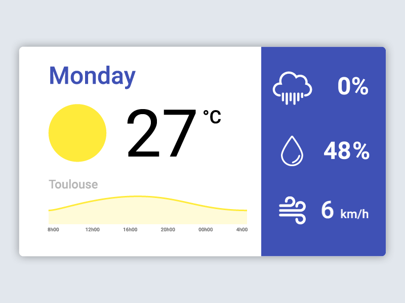

Is it raining today?
===============

_Build a simple Weather app with PHP Symfony!_



## Level 0 - Launch & Understand the app 

Clone https://github.com/simplonco/is-it-raining and make it work on your computer:

```shell
cd symfony-project
php bin/console server:run
firefox "http://127.0.0.1:8000/?q=Paris"
```

Try to change the value of the `q` GET parameter in the url.

## Level 1 - Choose an API

Build your own app, with this cool list of public APIs: https://github.com/toddmotto/public-apis

I choose for you an API which ask a city name parameter and return you weather informations: http://openweathermap.org/current#name

But of course you're free to use an other API of your choice!

## Level 2 - Retreive data

Try to change the API call in the file `src/AppBundle/Controller/DefaultController.php` (the controller) and display it (without CSS just as plain text) in the `app/Resources/view/default/index.html.twig` (the template view).

## Level 3 - Make it beautiful

Now free your creativity: add some CSS to make the app beautiful, and let user enter the city name in an HTML form (not directly in the URL)! You can use some templates, for example: http://codepen.io/davidkpiano/full/ByNPQw

## Level 4 - Make it secure

What's happen when for example you enter a wrong city name? Try to handle properly error.

## Ressources

> **Symfony Getting Started Tutorials**:
>
> Start here to learn the essentials about developing web applications with Symfony.
>
> - Chapter 1. *Setup* https://symfony.com/doc/current/setup.html
> - Chapter 2. *Creating Pages* https://symfony.com/doc/current/page_creation.html
> - Chapter 3. *Routing* https://symfony.com/doc/current/routing.html
> - Chapter 4. *Controllers* https://symfony.com/doc/current/controller.html
> - Chapter 5. *Templates* https://symfony.com/doc/current/templating.html
> - Chapter 6. *Configuration* https://symfony.com/doc/current/configuration.html
